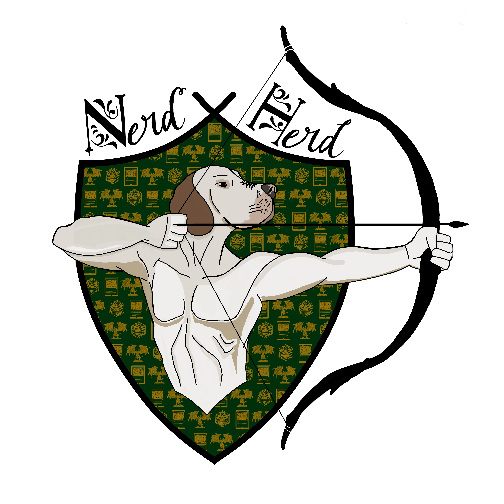

# Nerd_Herd_TTS

So... you want to play some 40k without suffering 6 hours of trains exploding with sweaty tourists...
Fear not, Tabletop simulator (and a blossoming community of players) is here to save you.

## What is Tabletop Simulator?

Well... the name speaks for itself. Tabletop simulator (TTS) is a game built to simulate a tabletop. This offers a blank canvas for modders, companies and communities. The game is programmed specifically to act as a scaffold for any game which uses a physical medium to be played (cards, models, figures, boards... practically all games that are not videogames). Thus it lends itself very well to playing Warhammer 40k.

###### Technical requirements
- Consider investing in a decent speaker and mic setup, nobody enjoys hearing your gf spreading the good word of Lorgar in the background. 
###### System requirements
- OS: Windows 7 SP1+/ macOS 10.12+
- Processor: SSE2 instruction set support.
- Memory: 4 GB RAM
- Graphics: Graphics card with DX10 (shader model 4.0) capabilities.
- DirectX: Version 10
- Network: Broadband Internet connection
- Storage: 3 GB available space
- VR Support: SteamVR

**Be mindful that even though TTS itself can be run on a potato, big 40k games can push up the requirements. Ask the ork player :)**

## Installation
Tabletop Simulator is available on steam, and it is discounted often and heavily. I hope i don't need to explain how to buy games on steam, but open an issue if that is giving you problems.

## Mods
Warhammer is a game with a very complicated and dynamic ruleset. This can make the game challenging to set up and play, but it also brings a big advantage. A LOT of nerds play it, and it just so happens that nerds are often good at programming, organising and automatising things. A community of 40k player has created two very important tools to play warhammer:
- **The [Battleforged mod](https://github.com/TTSWarhammer40k/Battleforged-Workshop-Mod-Compilation):** A tool that contains a table made specifically for 40k and a vast collection of maps and models.
- **The [Yellowscribe Mod](https://steamcommunity.com/sharedfiles/filedetails/?id=2920625970) and its [companion website](https://yellowscribe.xyz/):** Yellowscribe allows you to convert a battlescribe ```.rosz``` file into datasheets which can be assigned to ```battleforge```models and the be used to generate an army automatically. Keeping the datasheets and the models separated allows you to keep up with the latest rules without constantly updating models

## Creating and importing lists
Army lists are created with [Battlescribe](https://battlescribe.net/?tab=news). Export your list as a ```.rosz``` file.

## Setting up a game

## Playing a game

## Shortcuts and tips

## Best practices in TTS

