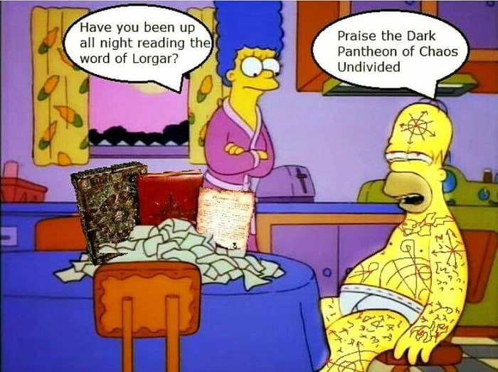

# The Nerd Herd's guide to Tabletop Simulator

So... you want to play some 40k without suffering 6 hours of trains exploding with sweaty tourists...
Fear not, Tabletop simulator (and a blossoming community of players) is here to save you.

## What is Tabletop Simulator?

Well... the name speaks for itself. Tabletop simulator (TTS) is a game built to simulate a tabletop. This offers a blank canvas for modders, companies and communities. The game is programmed specifically to act as a scaffold for any game which uses a physical medium to be played (cards, models, figures, boards... practically all games that are not videogames). Thus it lends itself very well to playing Warhammer 40k.

###### Technical requirements

- Consider investing in a decent speaker and mic setup, nobody enjoys hearing your gf spreading the good word of Lorgar in the background. 


###### System requirements
- OS: Windows 7 SP1+/ macOS 10.12+
- Processor: SSE2 instruction set support.
- Memory: 4 GB RAM
- Graphics: Graphics card with DX10 (shader model 4.0) capabilities.
- DirectX: Version 10
- Network: Broadband Internet connection
- Storage: 3 GB available space
- VR Support: SteamVR

**Be mindful that even though TTS itself can be run on a potato, big 40k games can push up the requirements. Ask the ork player :)**

## Installation
Tabletop Simulator is available on steam, and it is discounted often and heavily. I hope i don't need to explain how to buy games on steam, but open an issue if that is giving you problems.

## Mods
Warhammer is a game with a very complicated and dynamic ruleset. This can make the game challenging to set up and play, but it also brings a big advantage. A LOT of nerds play it, and it just so happens that nerds are often good at programming, organising and automatising things. A community of 40k player has created two very important tools to play warhammer:
- **The [ForgeOrg mod](https://steamcommunity.com/sharedfiles/filedetails/?id=3137407072):** A tool that contains and a vast collection of maps and models. Installation intructions are in their GitHub, since the table and the models need to be present on your machine.
- **The [competitive 40k map](https://steamcommunity.com/sharedfiles/filedetails/?id=2716384879):** A TTS table made specifically for 40k

Subscribe to all of them (you will find a lot of other useful stuff in the TTS mods, like a trophy for your opponent's epic snake eyes charge)


## Creating and importing lists

### New Recruit
When your list is ready, go in the top right corner, select ```List option``` then ```Export list``` and ```Yellowscribe```, then copy the code that got generated

Now, go back to the TTS main menu and open ForceOrg.

### ForceOrg

Once you are satisfied, go to the bottom of the website and hit submit. This will generate a code, which you will paste in the Yellowscribe table in TTS you had open in the background and submit again. This will generate all the datasheets of your army on the right side of the table. And on the left side you will generate your models by going to objects on top of the screen, hit saved objects and click the properly named subset of models we prepared. Then click on the left side of the table ONCE and then hit esc. 


Do NOT click multiple times or keep the mouse button down! (see above)

Well done! Now we have datasheets and models. To link them, click on a datasheet (which will light up pink) 


and select the appropriate model (this will turn the datasheet green). Note that multiple datasheets can be tied to the same model. 


Once all datasheets are green, hit the magical ```create army``` button. And there you go, Yellowscribe has generated your army with the appropriate models and the latest datasheets. Now select all the models and save them as an object by right clicking them. 


Congratulations! Your army is ready for battle! I know, not as pretty as your IRL army, but we'll make do.

## Setting up a game
Now to the juicy part, open the ```FTC competitive 40k map``` from the workshop contents as a multiplayer session. Select your preferred player color (red and blue can move models, grey cannot). Confirm that you are playing and not building a map (unless you're building a map of course), and select the appropriate map size for your game.


Once generated the playing field hit ```game``` on the top left and go to ```Save & Load --> Battleforged mod pack --> Warhammer 40,000 --> Maps & Terrain --> <your battle size>```. Ther you will find many maps, some contain broken or outdated textures, so they may look funky once loaded. Finding a good map is a roll of the dice, really (hehe, rolling dice... get it...?), but most of them look really solid and are up to date. Now select the three points displayed on the top right of the map, and go for ```additive loading```, this will load the map onto the table you have open without overwriting it. 


If any ```missing model``` dialog pops up just close them.


Tadaaaa, map loaded. Now head over to the top of the table. There you will enable a Grant Tournament scoreboard, where you can fill in primary objectives, secondaries, deployment zones. Here you will find a lot of markers to use to remind you of buffs, debuffs, actions, etc. etc. Also here you have tools to keep track of time, turns and phases.


Now head over to your side to the board and observe your hub zone (either red or blue, depending on your player color, on one side of the map). There you will find a dice board, where you can spawn and roll dice and generate your secondaries to keep a close eye on them.


Once everything is set up, import your army (which you named properly, right?) from your ```saved objects``` in the ```objects``` menu on top of the screen.


Once you army is generated remember that you can rename models to avoid incomprehension and forgetfulness (for example "chaos rhino" and "chaos rhino" become "Khârn rhino" and "'Zerker rhino"). Simply right-click the model and then left click on its name (you can also keep track of wounds this way without dragging around wound counters).


Also look on your side of the board and see that you have a small colored board where you can keep models in transports, reserves or deep strike.


And a final important tip: select all your army with the mouse, right click it, go to ```toogle``` and turn on ```measure movement```. This will display the distance a model moves every time it's picked up. Cool, right?


## Playing a game

So, assuming you can play 40k already, here are some basic commands.
- move your camera with ```WASD```, the ```mouse wheel``` and ```right click```
- pick, up, move and box-select models with your ```left-click```
- ```right click``` is also used to dive into more options on models
- - hover on one models to see stats, equipment and abilities
- Once you pick up a model or a unit use ```Q``` and ```E``` to rotate them
- if you pick up a unit use ```numbers``` to determine the ranks of the unit
- Ping models with ```tab``` when selecting units to shoot from and to
- hold ```tab``` to measure distances from models to models or terrain
- Flip models with ```F``` to keep track of dead models and then clear them after the morale phase
- Go to ```game``` and ```Save & Load``` to save your game exactly as it is a finish it at a second time

And here are some more advanced tips. It's a work in progress, so feel free to contribute as everybody discovers new stuff.
- Even more options are at your disposal on the keypad numbers!
- **1:** For even more details on the model rules and confusion prevention you can color your models or units so that you do not mix up your identical 8 units of 8 Berzerkers.
- **2:** Decrease wound count on a model by 1
- **3:** Increase wound count on a models by 1
- **4:** Increase aura size around a model by 1"
- **5:** Decrease aura size around a model by 1"
- **7:** Pass time to the other player

## Best practices in TTS

- Save the game at crucial points, so that you can check stuff both players forgot or prevent the loss of a big turn in case the host crashes.
- Create your army in advance. If one person has more time they can set up the map in advance. 
